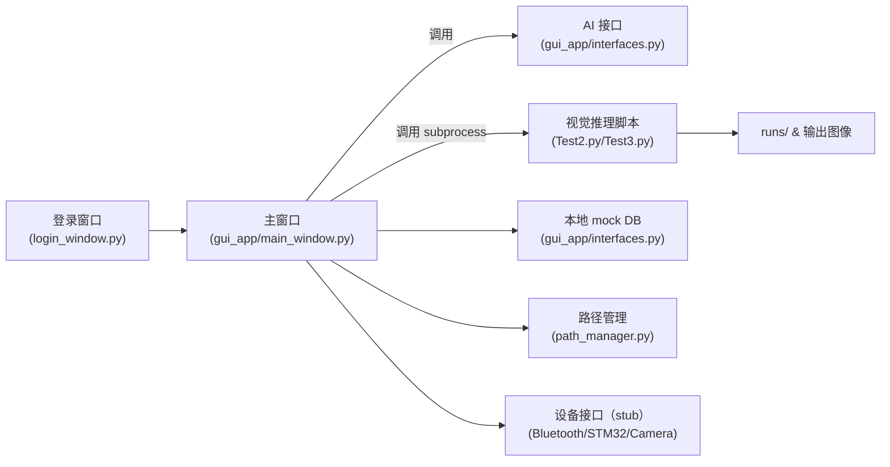
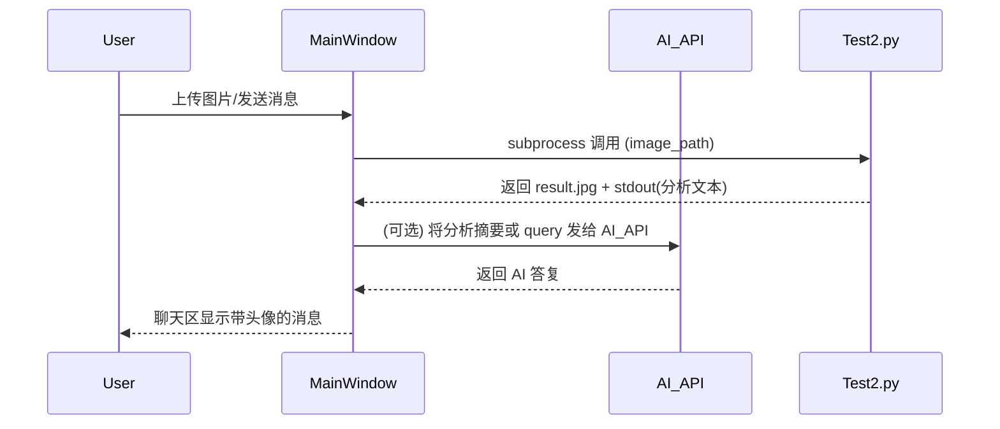

# GUI 技术文档

**概述**
- **目的**: 描述本项目的桌面图形化界面（PyQt5 实现）的架构、主要界面、关键文件、运行方式与扩展点，便于开发与维护。
- **技术栈**: Python 3.x, PyQt5, OpenCV (cv2), ultralytics YOLO (Test*.py), requests, subprocess

**架构图**


**界面与功能概览**
- **登录窗口**: 负责用户认证并将用户名传入主窗口（见 [gui_app/login_window.py](gui_app/login_window.py)）。
- **主窗口（控制视图）**: 位于 [gui_app/main_window.py](gui_app/main_window.py)。包含：
  - 菜单栏：系统设置、AI 设置、设备操作、账号管理、日志清理、头像设置等（使用 QAction 绑定回调）。
  - 聊天区：AI（左）与用户（右）气泡式对话显示，支持头像、用户名显示与自动滚动（`append_chat_message()`）。
  - 输入区：文本输入、发送按钮、模型选择下拉框（动态显示当前主模型 `self.main_model_label`）。
  - 图片分析：支持图片上传并通过 `subprocess` 调用 Test2.py 执行推理，解析结果并在聊天中返回摘要。
  - 设备状态面板：展示电量、串口/蓝牙占位信息（接口位于 [gui_app/interfaces.py](gui_app/interfaces.py)）。

**关键文件&职责**
- **[gui_app/main_window.py](gui_app/main_window.py)**: 主 UI 实现与大部分业务逻辑（菜单事件处理、聊天渲染、图片上传/推理调用、模型切换）。
- **[gui_app/interfaces.py](gui_app/interfaces.py)**: AI_API、DatabaseAPI 与设备接口类（BluetoothAPI、STM32API、CameraAPI 的 stub），AI 请求通过 `requests` 发起。
- **[path_manager.py](path_manager.py)**: 提供统一的资源路径（如 assest 目录），用于替换硬编码绝对路径。 
- **[Test2.py](Test2.py) / [Test3.py](Test3.py)**: 视觉推理脚本（YOLO + OpenCV），由主程序以 `subprocess` 调用，输入为图片路径，输出为可解析的 JSON/文本与带标注的结果图。
- **runs/**: 训练与推理的输出目录，args.yaml 已替换为相对路径以便移植。

**运行与开发步骤**
- 前提: 安装 Python 3.8+ 与依赖，推荐在虚拟环境中运行。

- 安装依赖示例（在项目根目录执行）:
```bash
python -m venv .venv
.venv\Scripts\activate
pip install -r requirements.txt
# 若无 requirements.txt, 安装关键依赖:
pip install PyQt5 opencv-python ultralytics requests
```

- 启动流程:
```powershell
# 在项目根（e:\orange）
python gui_app\main.py
# 或直接运行登录窗口，再进入主窗口
python gui_app\login_window.py
```

**图像分析调用流程**
1. 用户在主窗口触发“上传并分析图片”。
2. 主程序将图片复制/保存到工作目录的 upload 路径（由 `path_manager.assest_dir` 管理）。
3. 使用 `subprocess.run([python, Test2.py, image_path], ...)` 调用视觉脚本。
4. `Test2.py` 加载相对路径下的模型权重并保存带标注结果（例如 `result.jpg`），同时将解析文本写入 stdout 或生成 JSON 文件。
5. 主程序读取并解析脚本输出，将摘要通过 `append_chat_message()` 注入聊天区。

**扩展点（建议实现或改进）**
- 持久化设置：把 API Key、模型选择、头像路径等保存到 `config.json` 或系统密钥库，避免硬编码。
- 设备通信：实现 `gui_app/interfaces.py` 中的 BluetoothAPI/STM32API/CameraAPI 的真实逻辑（串口/蓝牙/摄像头采集）。
- 权限与安全：将敏感信息（如 `AI_API.api_key`）移至环境变量或 KeyVault。避免在代码中写明明文 key。
- 单元测试：为关键函数（如 `append_chat_message`、图片上传解析）添加单元测试。
- 截图与文档：在 docs/ 下保存截图并在本文档中引用（相对路径）。

**常见问题与排查**
- ModuleNotFoundError: path_manager — 确认 `path_manager.py` 存在于仓库根或 PYTHONPATH 中，主程序使用 `from path_manager import assest_dir`。
- 视觉脚本找不到模型权重：检查 `Test2.py` 中模型路径是否相对于项目根，确保 `runs/train/.../weights/best.pt` 存在或在脚本中支持传入权重路径参数。
- 子进程调用失败：在主程序中打印 `subprocess` 的 stdout/stderr，以便定位脚本异常。

**维护日志（最近改动要点）**
- 将菜单由静态字符串转换为 `QAction`，并实现了菜单回调函数（系统设置、AI 设置、清除日志、设备操作、头像设置等）。
- 聊天气泡改为 HTML 渲染，支持头像、用户名、左右布局与自动滚动（`append_chat_message`）。
- 将多处绝对路径替换为相对路径，并新增 `path_manager.py` 以统一管理资源路径。
- 图片上传功能通过 `subprocess` 调用 `Test2.py`，并在聊天中展示分析结果摘要。

**示例 Mermaid：主流程时序图**


**后续建议项（优先级）**
- 高: 将 `AI_API.api_key` 移至环境变量并在文档中说明配置方法。
- 中: 实现真实设备接口与持久化配置页面（菜单项行为由占位改为真实功能）。
- 低: 为聊天记录与用户配置添加导出/导入功能；为界面增加主题切换。

---
文档已保存为 [docs/GUI_Documentation.md](docs/GUI_Documentation.md)。如需我把关键截图添加到文档中，或把文档发布为 README 或 wiki 页面，请告诉我下一步。